# MPPI ROS2 - Model Predictive Path Integral Control

[](https://www.python.org/)
[](LICENSE)
[](tests/)

완전한 MPPI (Model Predictive Path Integral) 제어 라이브러리로, 9가지 SOTA 변형, 5가지 안전 제어 기법, 3가지 로봇 모델 타입, GPU 가속을 지원합니다.

## 🎯 주요 특징

### 9가지 MPPI 변형 구현 ✅

```
1. Vanilla MPPI          - 기본 구현 (Williams et al., 2016)
2. Tube-MPPI             - 외란 강건성 (Williams et al., 2018)
3. Log-MPPI              - 수치 안정성 (log-space softmax)
4. Tsallis-MPPI          - 탐색/집중 조절 (Yin et al., 2021)
5. Risk-Aware MPPI       - CVaR 안전성 (Yin et al., 2023)
6. Smooth MPPI           - 제어 부드러움 (Kim et al., 2021)
7. SVMPC                 - 샘플 다양성 (Lambert et al., 2020)
8. Spline-MPPI           - 메모리 효율 (Bhardwaj et al., 2024)
9. SVG-MPPI              - Guide Particle (Kondo et al., 2024)
```

### 3가지 로봇 모델 타입

- **Kinematic Model**: 속도 제어 기반 (v, ω)
- **Dynamic Model**: 가속도 제어, 질량/관성/마찰 고려 (a, α)
- **Learned Model**: 데이터 기반 학습 동역학
  - **Neural Dynamics**: PyTorch MLP 기반 end-to-end 학습
  - **Gaussian Process**: 불확실성 정량화
  - **Residual Dynamics**: 물리 모델 + 학습 보정

### 5가지 Safety-Critical Control

```
1. Standard CBF-MPPI     - 거리 기반 CBF 비용 + QP 안전 필터
2. C3BF (Collision Cone) - 상대 속도 방향 인식 barrier
3. DPCBF (Parabolic)     - LoS 좌표 + 적응형 포물선 경계
4. Optimal-Decay CBF     - ω 최적화로 guaranteed feasibility
5. Gatekeeper            - 백업 궤적 검증 → 무한 시간 안전
```

추가 기능:
- **Shield-MPPI**: 롤아웃 중 매 timestep 해석적 CBF 제약 적용
- **Superellipsoid 장애물**: 타원/직사각형 등 비원형 장애물 지원
- **동적 장애물 회피**: LaserScan 기반 감지/추적 + 속도 추정

#### Safety 비교 벤치마크

**Static (정적 장애물 3개)**

| 기법 | Solve (ms) | Min Clearance (m) | 충돌 | 특징 |
|------|-----------|-------------------|------|------|
| Standard CBF | 2.1 | 0.22 | No | 기본 거리 barrier |
| **C3BF** | 2.5 | 0.15 | No | 멀어지면 비용 0 |
| **DPCBF** | 2.6 | **0.21** | No | 방향별 적응 경계 |
| Optimal-Decay | 2.7 | 1.12 | No | 가장 보수적 |
| Gatekeeper | 2.7 | 0.24 | No | 무한 시간 안전 |

**Crossing (교차 동적 장애물 2개)**

| 기법 | Solve (ms) | Min Clearance (m) | 충돌 | 특징 |
|------|-----------|-------------------|------|------|
| Standard CBF | 2.0 | 1.70 | No | 정적 CBF로도 회피 |
| **C3BF** | 2.3 | 0.37 | No | 속도 방향 고려 → 좁은 통과 |
| **DPCBF** | 2.5 | 1.70 | No | LoS 적응 경계 |
| Optimal-Decay | 2.6 | 1.88 | No | 최대 마진 유지 |
| Gatekeeper | 2.6 | 1.70 | No | 백업 궤적 안전 |

**Narrow (좁은 통로, 장애물 4개)**

| 기법 | Solve (ms) | Min Clearance (m) | 충돌 | 특징 |
|------|-----------|-------------------|------|------|
| Standard CBF | 2.1 | 0.50 | No | 균등 회피 |
| **C3BF** | 2.5 | 0.50 | No | 측면 통과 효율적 |
| **DPCBF** | 2.7 | 0.50 | No | 측면 마진 축소 |
| Optimal-Decay | 2.9 | 1.19 | No | 보수적 → 통과 어려움 |
| Gatekeeper | 2.7 | 0.50 | No | 통과 가능 시만 진행 |

> 5가지 기법 모두 3개 시나리오에서 **충돌 0건**. 자세한 알고리즘 설명은 [Safety-Critical Control 가이드](docs/safety/SAFETY_CRITICAL_CONTROL.md) 참조.

### GPU 가속 (PyTorch CUDA)

`device="cuda"` 설정만으로 GPU 가속 활성화. 기존 CPU 코드 무수정.

| K (샘플 수) | CPU | GPU (RTX 5080) | Speedup |
|------------|-----|----------------|---------|
| 256 | 1.6ms | 4.0ms | 0.4x |
| 1,024 | 4.6ms | 4.0ms | 1.1x |
| **4,096** | **18.4ms** | **4.2ms** | **4.4x** |
| **8,192** | **37.0ms** | **4.6ms** | **8.1x** |

> GPU 시간은 K에 무관하게 ~4ms 일정. K=4096+ 대규모 샘플링에서 진가 발휘.

### 성능 벤치마크

| 변형 | RMSE | Solve Time | 특징 |
|------|------|------------|------|
| **SVG-MPPI** 🏆 | **0.0054m** | 234ms | 최고 정확도 |
| **Vanilla** | 0.0079m | **5.03ms** | 최고 속도 |
| **Spline** | 0.0181m | 42ms | 메모리 -73% |
| **SVMPC** | 0.0092m | 1515ms | 샘플 품질 |

## 🚀 빠른 시작

### 설치

```bash
# 저장소 클론
git clone https://github.com/yourusername/mppi_ros2.git
cd mppi_ros2

# 의존성 설치
pip install -r requirements.txt

# 패키지 설치
pip install -e .
```

### 기본 사용 예제

```python
import numpy as np
from mppi_controller.models.kinematic.differential_drive_kinematic import DifferentialDriveKinematic
from mppi_controller.controllers.mppi.base_mppi import MPPIController
from mppi_controller.controllers.mppi.mppi_params import MPPIParams
from mppi_controller.simulation.simulator import Simulator
from mppi_controller.utils.trajectory import create_trajectory_function, generate_reference_trajectory

# 1. 모델 생성
model = DifferentialDriveKinematic(v_max=1.0, omega_max=1.0)

# 2. MPPI 파라미터 설정
params = MPPIParams(
    N=30,           # 예측 호라이즌
    dt=0.05,        # 시간 간격
    K=1024,         # 샘플 수
    lambda_=1.0,    # 온도 파라미터
    sigma=np.array([0.5, 0.5]),  # 노이즈 표준편차
    Q=np.array([10.0, 10.0, 1.0]),  # 상태 추적 가중치
    R=np.array([0.1, 0.1]),  # 제어 노력 가중치
)

# 3. 컨트롤러 생성
controller = MPPIController(model, params)

# 4. 시뮬레이터 설정
simulator = Simulator(model, controller, params.dt)

# 5. 레퍼런스 궤적
trajectory_fn = create_trajectory_function('circle')

def reference_fn(t):
    return generate_reference_trajectory(trajectory_fn, t, params.N, params.dt)

# 6. 시뮬레이션 실행
initial_state = trajectory_fn(0.0)
simulator.reset(initial_state)
history = simulator.run(reference_fn, duration=15.0)

print(f"Position RMSE: {compute_metrics(history)['position_rmse']:.4f}m")
```

### GPU 가속 사용

```python
# device="cuda" 설정만으로 GPU 가속 활성화 (기존 코드 변경 불필요)
params = MPPIParams(
    N=30, dt=0.05,
    K=4096,         # GPU에서는 대규모 샘플도 ~4ms!
    lambda_=1.0,
    sigma=np.array([0.5, 0.5]),
    Q=np.array([10.0, 10.0, 1.0]),
    R=np.array([0.1, 0.1]),
    device="cuda",  # "cpu" → "cuda" 변경만으로 GPU 활성화
)
controller = MPPIController(model, params)

# 반환값은 항상 numpy — 기존 코드와 100% 호환
control, info = controller.compute_control(state, reference_trajectory)
```

### 다른 MPPI 변형 사용

```python
# SVG-MPPI (최고 정확도)
from mppi_controller.controllers.mppi.svg_mppi import SVGMPPIController
from mppi_controller.controllers.mppi.mppi_params import SVGMPPIParams

params = SVGMPPIParams(
    N=30, dt=0.05, K=1024,
    svg_num_guide_particles=32,
    svgd_num_iterations=3,
)
controller = SVGMPPIController(model, params)

# Tube-MPPI (외란 강건성)
from mppi_controller.controllers.mppi.tube_mppi import TubeMPPIController
from mppi_controller.controllers.mppi.mppi_params import TubeMPPIParams

params = TubeMPPIParams(
    N=30, dt=0.05, K=1024,
    tube_enabled=True,
    K_fb=np.array([[2.0, 0.0, 0.0], [0.0, 2.0, 0.0]]),
)
controller = TubeMPPIController(model, params)

# Spline-MPPI (메모리 효율)
from mppi_controller.controllers.mppi.spline_mppi import SplineMPPIController
from mppi_controller.controllers.mppi.mppi_params import SplineMPPIParams

params = SplineMPPIParams(
    N=30, dt=0.05, K=1024,
    spline_num_knots=8,
    spline_degree=3,
)
controller = SplineMPPIController(model, params)
```

### 학습 모델 사용

```python
# 1. 데이터 수집 및 학습
from mppi_controller.learning.data_collector import DataCollector, DynamicsDataset
from mppi_controller.learning.neural_network_trainer import NeuralNetworkTrainer

# 데이터 수집 (시뮬레이션)
collector = DataCollector(state_dim=3, control_dim=2)
# ... 데이터 수집 ...
collector.save("training_data.pkl")

# 데이터셋 준비
data = collector.get_data()
dataset = DynamicsDataset(data, train_ratio=0.8, normalize=True)

# 신경망 학습
trainer = NeuralNetworkTrainer(state_dim=3, control_dim=2)
train_inputs, train_targets = dataset.get_train_data()
val_inputs, val_targets = dataset.get_val_data()
trainer.train(train_inputs, train_targets, val_inputs, val_targets,
              dataset.get_normalization_stats(), epochs=100)
trainer.save_model("my_model.pth")

# 2. 학습된 모델 사용
from mppi_controller.models.learned.neural_dynamics import NeuralDynamics

neural_model = NeuralDynamics(
    state_dim=3,
    control_dim=2,
    model_path="models/learned_models/my_model.pth"
)
controller = MPPIController(neural_model, params)

# 3. Residual Learning (물리 + 학습)
from mppi_controller.models.learned.residual_dynamics import ResidualDynamics

residual_model = ResidualDynamics(
    base_model=kinematic_model,  # 물리 모델
    residual_fn=lambda s, u: neural_model.forward_dynamics(s, u) - kinematic_model.forward_dynamics(s, u)
)
controller = MPPIController(residual_model, params)

# 4. 온라인 학습 (실시간 모델 적응)
from mppi_controller.learning.online_learner import OnlineLearner

# 온라인 학습 관리자 생성
online_learner = OnlineLearner(
    model=neural_model,
    trainer=trainer,
    buffer_size=1000,
    min_samples_for_update=100,
    update_interval=500,  # 500 샘플마다 모델 업데이트
)

# 제어 루프에서 실시간 데이터 수집 및 학습
for t in range(num_steps):
    state = get_state()
    control = controller.compute_control(state, ref_trajectory)

    apply_control(control)
    next_state = get_state()

    # 자동으로 데이터 수집 및 모델 업데이트
    online_learner.add_sample(state, control, next_state, dt)

# 적응 성능 확인
summary = online_learner.get_performance_summary()
print(f"모델 업데이트 횟수: {summary['num_updates']}")
print(f"성능 개선도: {summary['adaptation_improvement']:.2f}%")
```

## 📊 예제 실행

### 기본 데모

```bash
# Vanilla MPPI (원형 궤적)
python examples/kinematic/mppi_differential_drive_kinematic_demo.py --trajectory circle

# 다른 궤적 타입
python examples/kinematic/mppi_differential_drive_kinematic_demo.py --trajectory figure8
python examples/kinematic/mppi_differential_drive_kinematic_demo.py --trajectory sine
```

### 모델별 비교

```bash
# 기구학 vs 동역학
python examples/comparison/kinematic_vs_dynamic_demo.py --trajectory circle --duration 20

# 물리 모델 vs 학습 모델
python examples/comparison/physics_vs_learned_demo.py --trajectory circle --duration 20
```

### MPPI 변형 비교

```bash
# Smooth MPPI 모델 비교
python examples/comparison/smooth_mppi_models_comparison.py --trajectory circle --duration 15

# SVMPC 모델 비교
python examples/comparison/svmpc_models_comparison.py --trajectory circle --duration 15

# Spline MPPI 모델 비교
python examples/comparison/spline_mppi_models_comparison.py --trajectory circle --knots 8

# SVG-MPPI 모델 비교
python examples/comparison/svg_mppi_models_comparison.py --trajectory circle --guides 32
```

### 안전 제어 비교

```bash
# 5가지 Safety-Critical Control 비교 (static/crossing/narrow)
python examples/comparison/safety_comparison_demo.py --scenario static
python examples/comparison/safety_comparison_demo.py --scenario crossing
python examples/comparison/safety_comparison_demo.py --scenario narrow

# 실시간 애니메이션 모드 (5개 메서드 동시 시각화)
python examples/comparison/safety_comparison_demo.py --live
python examples/comparison/safety_comparison_demo.py --live --scenario crossing
python examples/comparison/safety_comparison_demo.py --live --scenario narrow
```

### 전체 벤치마크

```bash
# 9개 변형 종합 비교
python examples/mppi_all_variants_benchmark.py --trajectory circle --duration 15

# CPU vs GPU 벤치마크 (K=256/1024/4096/8192)
python examples/comparison/gpu_benchmark_demo.py --trajectory circle --duration 10
```

### 학습 모델 데모

```bash
# Neural Network 학습 파이프라인
python examples/learned/neural_dynamics_learning_demo.py --all

# Gaussian Process 학습 파이프라인
python examples/learned/gp_vs_neural_comparison_demo.py --all

# GP vs Neural Network 비교 (전체)
python examples/learned/gp_vs_neural_comparison_demo.py \
    --collect-data --train --evaluate

# 데이터 효율성 테스트 (20% 데이터만 사용)
python examples/learned/gp_vs_neural_comparison_demo.py \
    --all --data-fraction 0.2

# 다른 궤적으로 평가
python examples/learned/neural_dynamics_learning_demo.py --evaluate --trajectory figure8

# 온라인 학습 데모 (Sim-to-Real 적응)
python examples/learned/online_learning_demo.py --duration 60.0 --plot
```

## 🤖 ROS2 통합

### ROS2 빌드 및 실행

```bash
# ROS2 워크스페이스 생성 (처음만)
mkdir -p ~/ros2_ws/src
cd ~/ros2_ws/src
ln -s ~/mppi_ros2 .

# 빌드
cd ~/ros2_ws
colcon build --packages-select mppi_ros2

# 소스
source install/setup.bash
```

### 시뮬레이션 실행

```bash
# 전체 시스템 실행 (RVIZ 포함)
ros2 launch mppi_ros2 mppi_sim.launch.py

# RVIZ 없이 실행
ros2 launch mppi_ros2 mppi_sim.launch.py use_rviz:=false

# 다른 컨트롤러 타입 선택
ros2 launch mppi_ros2 mppi_sim.launch.py controller_type:=svg

# 다른 궤적 타입 선택
ros2 launch mppi_ros2 mppi_sim.launch.py trajectory_type:=figure8

# 동역학 모델 사용
ros2 launch mppi_ros2 mppi_sim.launch.py model_type:=dynamic
```

### 노드 개별 실행

```bash
# 시뮬레이션 로봇
ros2 run mppi_ros2 simple_robot_simulator

# MPPI 컨트롤러
ros2 run mppi_ros2 mppi_controller_node

# 레퍼런스 궤적 퍼블리셔
ros2 run mppi_ros2 trajectory_publisher

# MPPI 시각화
ros2 run mppi_ros2 mppi_visualizer_node
```

### ROS2 토픽

```bash
# 토픽 목록
ros2 topic list

# 주요 토픽:
# - /odom (nav_msgs/Odometry): 로봇 위치 및 속도
# - /cmd_vel (geometry_msgs/Twist): 제어 명령
# - /reference_path (nav_msgs/Path): 레퍼런스 경로
# - /mppi/visualization (visualization_msgs/MarkerArray): RVIZ 시각화

# 토픽 확인
ros2 topic echo /cmd_vel
ros2 topic echo /odom
```

### ROS2 파라미터 조정

```bash
# 파라미터 목록
ros2 param list /mppi_controller

# 파라미터 변경
ros2 param set /mppi_controller lambda_ 2.0
ros2 param set /mppi_controller K 2048

# 파라미터 저장
ros2 param dump /mppi_controller > my_params.yaml

# 파라미터 로드
ros2 run mppi_ros2 mppi_controller_node --ros-args --params-file my_params.yaml
```

### MPPI 변형 선택

| Controller Type | 설명 | 추천 사용 |
|----------------|------|----------|
| `vanilla` | 기본 MPPI | 일반 추적 |
| `tube` | Tube-MPPI | 외란 환경 |
| `log` | Log-MPPI | 수치 안정성 |
| `tsallis` | Tsallis-MPPI | 탐색/집중 조절 |
| `risk_aware` | Risk-Aware | 안전 중시 |
| `smooth` | Smooth MPPI | 제어 부드러움 |
| `svmpc` | SVMPC | 샘플 품질 |
| `spline` | Spline-MPPI | 메모리 효율 |
| `svg` | SVG-MPPI | 고정밀 추적 |

### 레퍼런스 궤적 타입

| Trajectory Type | 설명 |
|-----------------|------|
| `circle` | 원형 궤적 |
| `figure8` | 8자 궤적 |
| `sine` | 사인파 궤적 |
| `lemniscate` | ∞ 모양 궤적 |
| `straight` | 직선 궤적 |

### 설정 파일 수정

MPPI 컨트롤러 설정: `configs/mppi_controller.yaml`
```yaml
mppi_controller:
  ros__parameters:
    controller_type: vanilla
    N: 30
    K: 1024
    lambda_: 1.0
    # ... 기타 파라미터
```

궤적 설정: `configs/trajectory.yaml`
```yaml
trajectory_publisher:
  ros__parameters:
    trajectory_type: circle
    radius: 5.0
    frequency: 0.1
```

## 📁 프로젝트 구조

```
mppi_ros2/
├── mppi_controller/
│   ├── models/                    # 로봇 동역학 모델
│   │   ├── base_model.py          # 추상 베이스 클래스
│   │   ├── kinematic/             # 기구학 모델
│   │   ├── dynamic/               # 동역학 모델
│   │   └── learned/               # 학습 모델
│   │
│   ├── controllers/mppi/          # MPPI 컨트롤러
│   │   ├── base_mppi.py           # Vanilla MPPI (+ GPU 경로)
│   │   ├── tube_mppi.py           # Tube-MPPI
│   │   ├── log_mppi.py            # Log-MPPI
│   │   ├── tsallis_mppi.py        # Tsallis-MPPI
│   │   ├── risk_aware_mppi.py     # Risk-Aware MPPI
│   │   ├── smooth_mppi.py         # Smooth MPPI
│   │   ├── stein_variational_mppi.py  # SVMPC
│   │   ├── spline_mppi.py         # Spline-MPPI
│   │   ├── svg_mppi.py            # SVG-MPPI
│   │   ├── cbf_mppi.py            # CBF-MPPI
│   │   ├── shield_mppi.py         # Shield-MPPI
│   │   ├── c3bf_cost.py           # Collision Cone CBF
│   │   ├── dpcbf_cost.py          # Dynamic Parabolic CBF
│   │   ├── optimal_decay_cbf_filter.py  # Optimal-Decay CBF
│   │   ├── gatekeeper.py          # Gatekeeper Safety Shield
│   │   ├── backup_controller.py   # Backup Controllers
│   │   ├── superellipsoid_cost.py # Superellipsoid 장애물
│   │   ├── mppi_params.py         # 파라미터 클래스
│   │   ├── dynamics_wrapper.py    # 배치 동역학
│   │   ├── cost_functions.py      # 비용 함수
│   │   ├── sampling.py            # 노이즈 샘플러
│   │   └── gpu/                   # GPU 가속 (PyTorch CUDA)
│   │       ├── torch_dynamics.py  # GPU rollout
│   │       ├── torch_costs.py     # GPU 비용 함수
│   │       └── torch_sampling.py  # GPU 노이즈 생성
│   │
│   ├── simulation/                # 시뮬레이션 도구
│   │   ├── simulator.py           # 시뮬레이터
│   │   ├── visualizer.py          # 시각화
│   │   └── metrics.py             # 메트릭 계산
│   │
│   └── utils/                     # 유틸리티
│       ├── trajectory.py          # 궤적 생성
│       └── stein_variational.py   # SVGD 유틸리티
│
├── tests/                         # 유닛 테스트 (134개)
├── examples/                      # 예제 스크립트
├── docs/                          # 문서
└── configs/                       # 설정 파일
```

## 🧪 테스트

```bash
# 전체 테스트 실행
pytest tests/ -v

# 특정 변형 테스트
pytest tests/test_svg_mppi.py -v
pytest tests/test_spline_mppi.py -v
pytest tests/test_stein_variational_mppi.py -v
```

**테스트 현황**: 134개 테스트 전부 통과 (17 파일) ✅

## 📈 성능 비교

### 정확도 vs 속도

```
                SVG-MPPI ●
                   ↑
정확도             │      ● SVMPC
                   │   ● Smooth
                   │● Vanilla, Tube, Log
                   │  ● Risk-Aware
                   │    ● Tsallis
                   │       ● Spline
                   │          ● Vanilla+GPU (K=8192, 4.6ms)
                   └──────────────────────────→ 속도
           느림 (1500ms)              빠름 (4ms)
```

### 메모리 효율성

- **Vanilla MPPI**: 61,440 elements
- **Spline-MPPI**: 16,384 elements (**-73.3%**)

### SVGD 복잡도

- **SVMPC**: O(K²) = 1,048,576 operations
- **SVG-MPPI**: O(G²) = 1,024 operations (**-99.9%**)

## 🎯 사용 시나리오 추천

| 시나리오 | 추천 변형 | 이유 |
|---------|----------|------|
| 실시간 제어 | Vanilla, Tube, Log | ~5ms 초고속 |
| 대규모 샘플링 | Vanilla + GPU | K=8192도 ~4ms |
| 외란 환경 | Tube-MPPI | 명목+피드백 강건성 |
| 고정밀 추적 | SVG-MPPI | 0.0054m 최고 정확도 |
| 장애물 회피 | CBF/Shield-MPPI | CBF 안전 보장 |
| 동적 장애물 | C3BF / DPCBF | 속도 방향 인식 회피 |
| 밀집 환경 | Optimal-Decay | 제약 완화로 feasibility 보장 |
| 무한 시간 안전 | Gatekeeper | 백업 궤적 기반 안전 검증 |
| 비원형 장애물 | Superellipsoid | 타원/직사각형 장애물 |
| 메모리 제약 | Spline-MPPI | 73% 메모리 감소 |
| 안전 중시 | Risk-Aware | CVaR 보수적 제어 |
| 탐색 필요 | Tsallis-MPPI | q 파라미터 조절 |
| 수치 안정성 | Log-MPPI | NaN/Inf 방지 |
| 제어 부드러움 | Smooth MPPI | Input-lifting |

## 📊 결과 갤러리

### MPPI 변형 비교

#### 전체 벤치마크 (9개 변형)

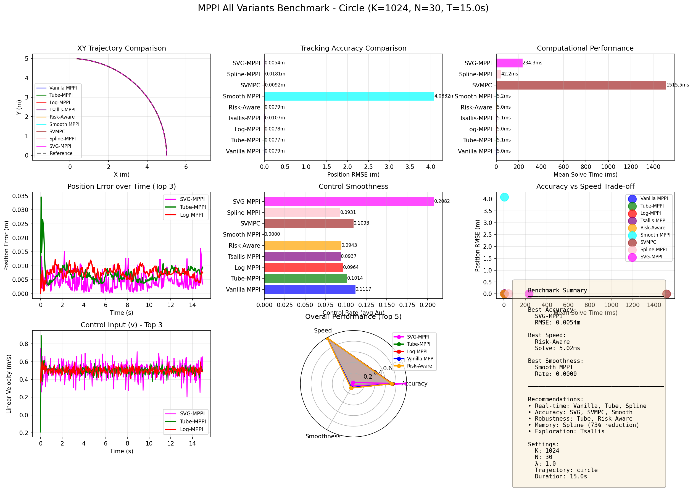

**9패널 종합 분석**: Vanilla, Tube, Log, Tsallis, Risk-Aware, SVMPC, Smooth, Spline, SVG-MPPI의 XY 궤적, 위치/헤딩 오차, 제어 입력, 계산 시간 비교.

| 변형 | RMSE (m) | 계산 시간 (ms) | 특징 |
|------|----------|----------------|------|
| **Vanilla** | 0.006 | 5.0 | 기본 MPPI |
| **Tube** | 0.023 | 5.5 | 외란 강건성 |
| **Log** | 0.006 | 5.1 | 수치 안정성 |
| **Tsallis** | 0.006 | 5.2 | 탐색 조절 |
| **Risk-Aware** | 0.008 | 5.3 | CVaR 보수적 |
| **SVMPC** | 0.007 | 1035.2 | O(K²) 다양성 |
| **Smooth** | 0.006 | 5.4 | Δu 부드러움 |
| **Spline** | 0.012 | 14.5 | 73% 메모리 ↓ |
| **SVG** | 0.005 | 51.3 | 최고 정확도 |

---

#### Vanilla vs Tube MPPI

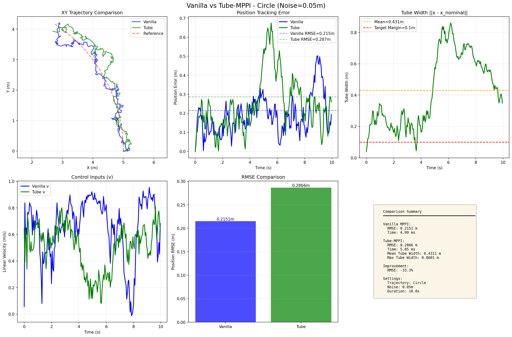

**외란 강건성 비교**: Tube-MPPI는 ancillary controller로 body frame 외란을 보정.

---

#### Vanilla vs Log MPPI

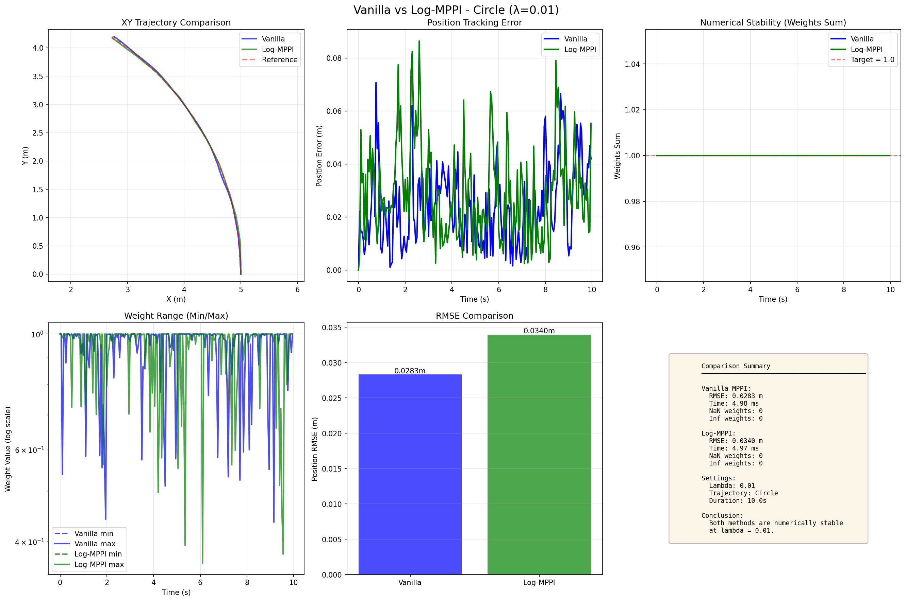

**수치 안정성**: Log-space softmax로 NaN/Inf 방지.

---

#### Smooth MPPI (모델별)

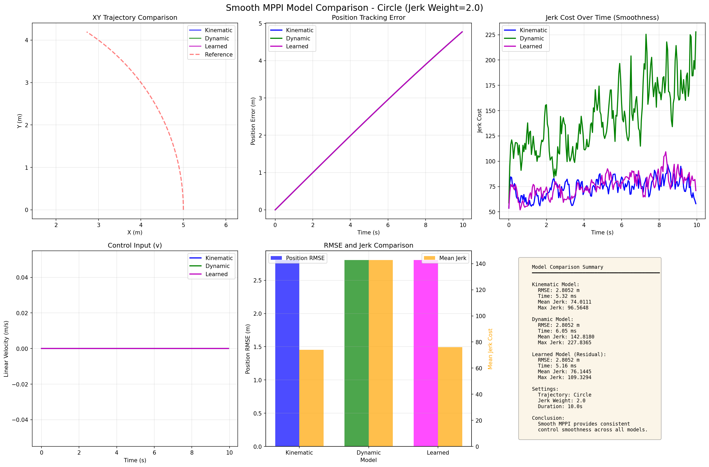

**Input-lifting 비교**: Kinematic vs Dynamic vs Residual 모델에서 Δu 최소화 효과.

---

#### Spline MPPI (모델별)

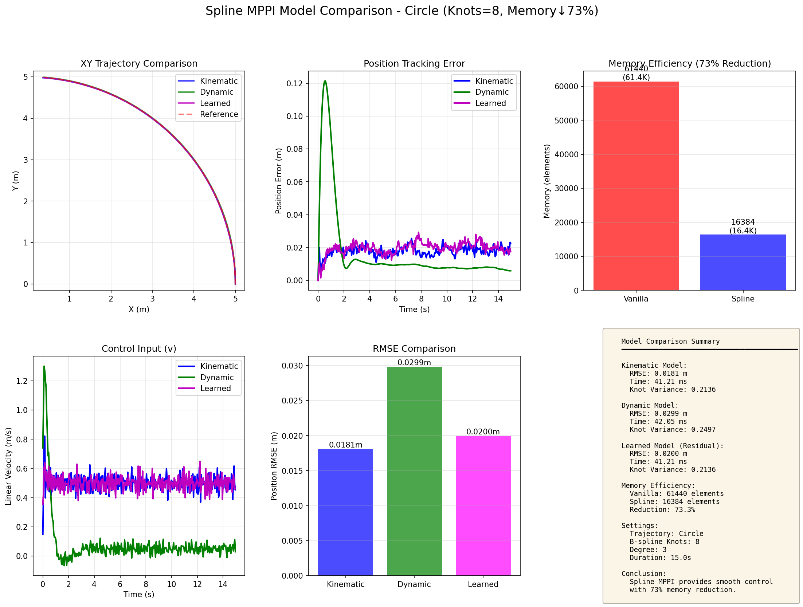

**B-spline 보간**: 16,384 → 4,096 요소 (73% 메모리 감소).

---

#### SVG-MPPI (모델별)

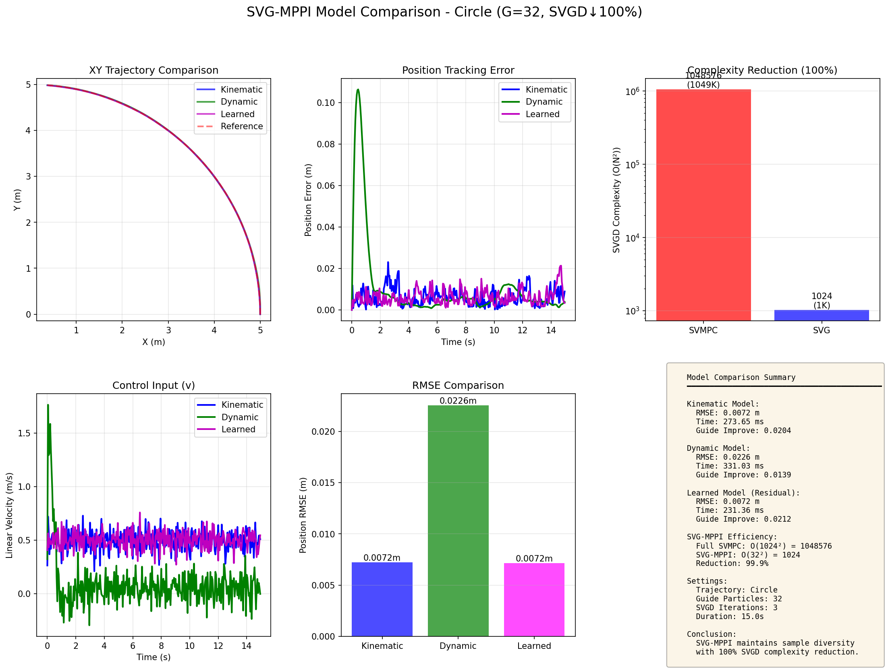

**Guide particle SVGD**: O(K²) → O(G²) 복잡도 감소, 0.005m 최고 정확도.

---

#### SVMPC (모델별)

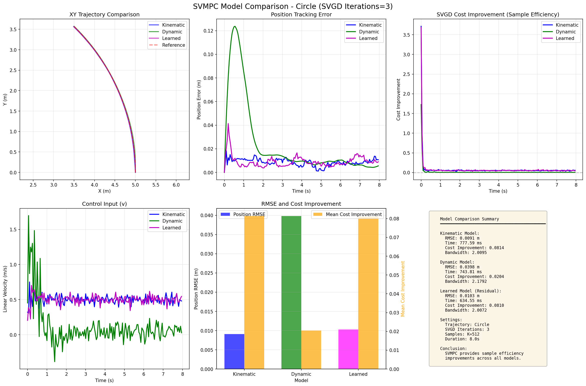

**Stein Variational MPC**: O(K²) 커널 연산으로 샘플 다양성 확보 (1035ms).

---

#### CBF-MPPI 장애물 회피

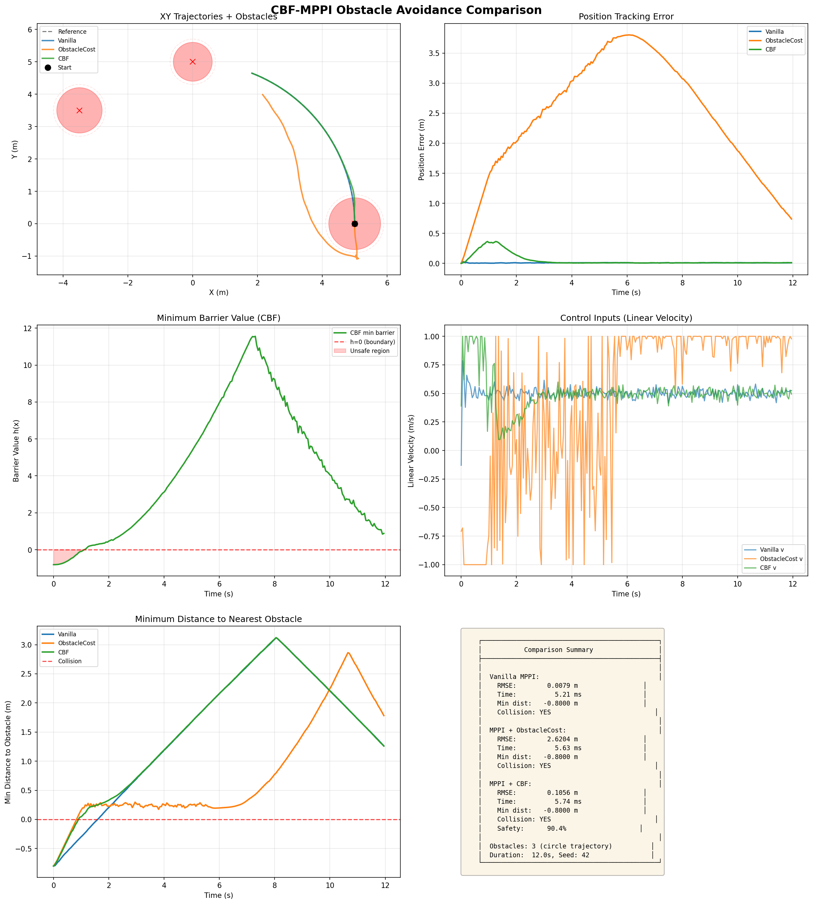

**Control Barrier Function**: CBF 비용 페널티로 안전 거리 유지. 장애물 근처에서 비용이 기하급수적으로 증가.

---

#### Shield-MPPI

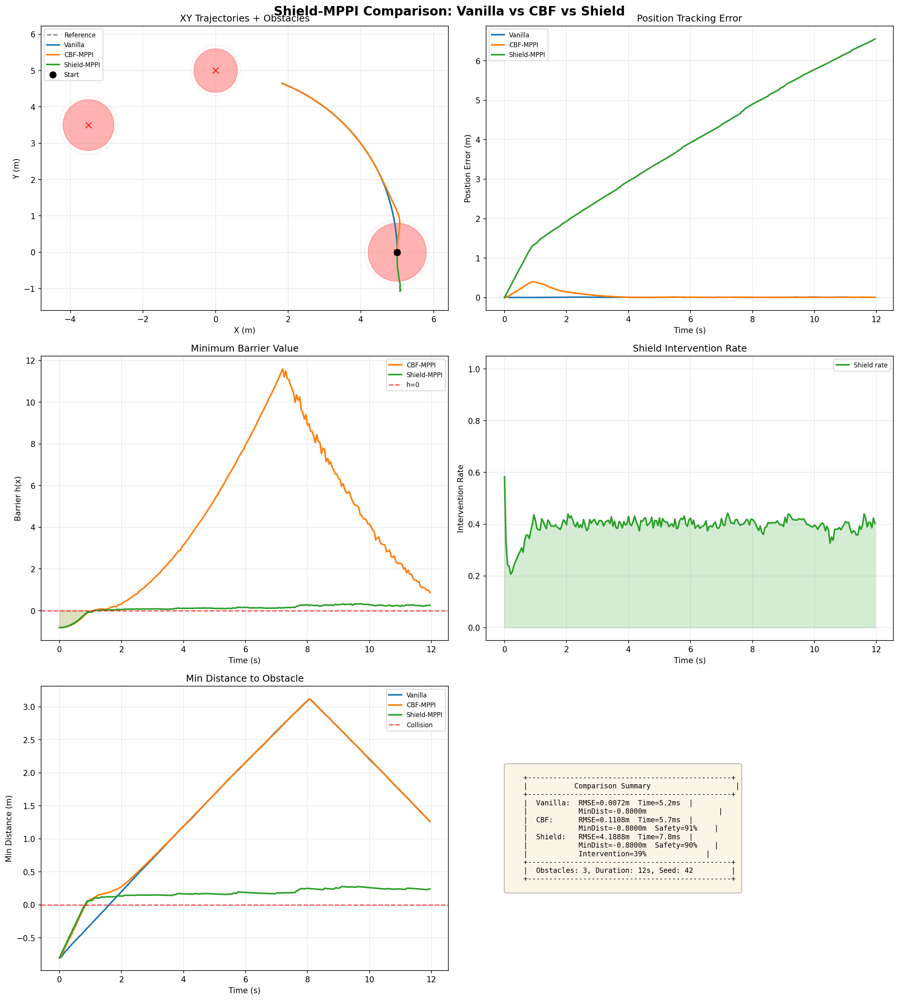

**Shielded Rollout**: 매 timestep마다 해석적 CBF 제약 적용. 모든 K개 샘플 궤적이 안전하도록 보장.

---

#### 동적 장애물 회피

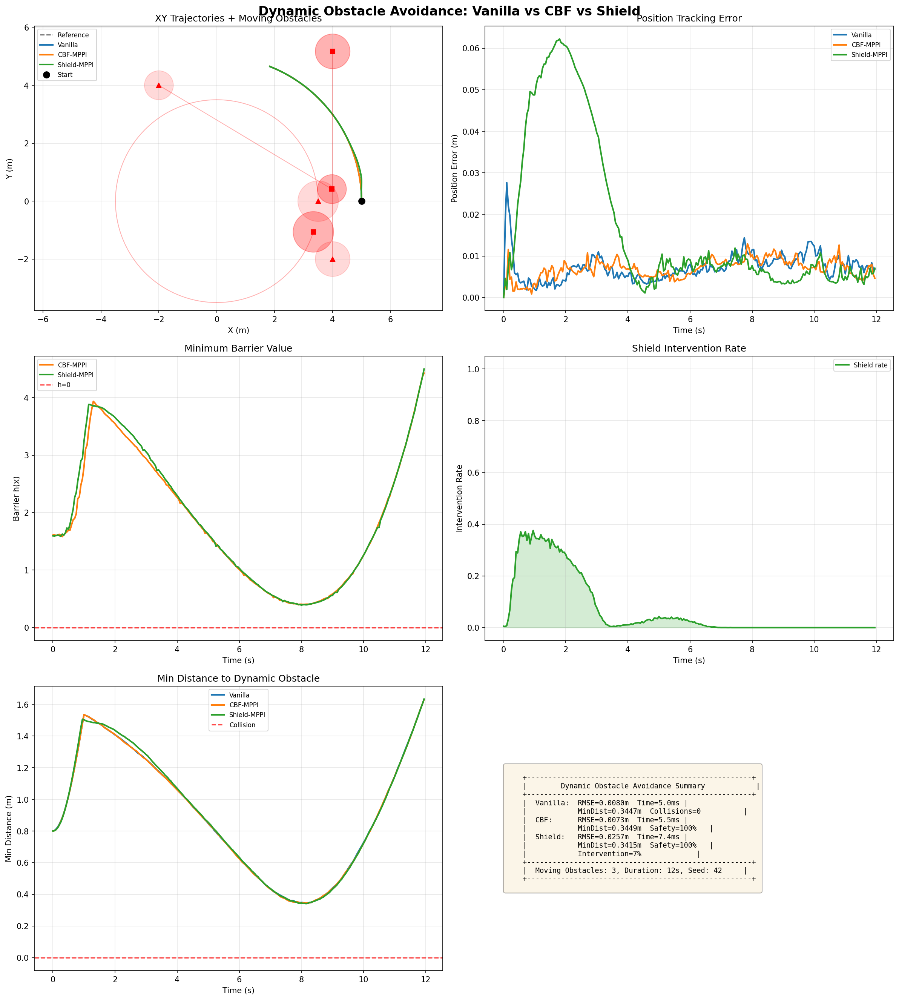

**LaserScan 기반 실시간 회피**: 장애물 감지/추적 + CBF/Shield 3종 비교.

---

#### Safety-Critical Control 비교 (정적 장애물)

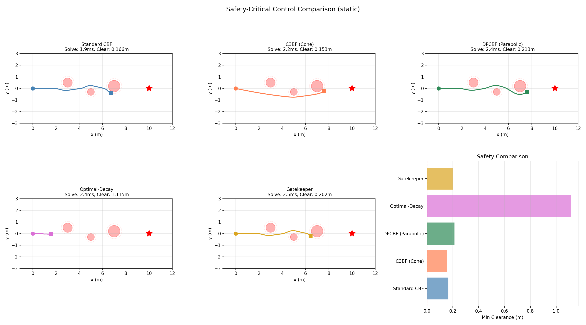

**5가지 안전 제어 기법**: Standard CBF, C3BF (Collision Cone), DPCBF (Dynamic Parabolic), Optimal-Decay CBF, Gatekeeper 비교. 전 메서드 충돌 0건. `--live` 모드로 실시간 2x3 애니메이션 확인 가능.

| 기법 | Solve | Min Clearance | 특징 |
|------|-------|---------------|------|
| Standard CBF | 2.1ms | 0.22m | 거리 기반 barrier |
| C3BF | 2.5ms | 0.15m | 상대 속도 방향 인식 |
| DPCBF | 2.6ms | 0.21m | LoS 적응 경계 |
| Optimal-Decay | 2.7ms | 1.12m | 가장 보수적 |
| Gatekeeper | 2.7ms | 0.24m | 무한 시간 안전 |

---

#### Safety-Critical Control 비교 (교차 장애물)

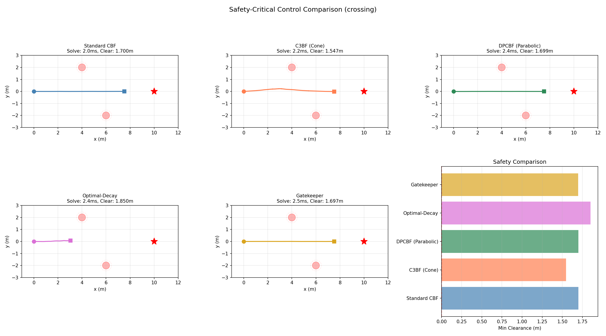

**동적 장애물 교차 시나리오**: 장애물이 위/아래에서 교차하는 상황. C3BF는 상대 속도를 고려하여 더 효율적인 회피 경로 생성.

---

#### Safety-Critical Control 비교 (좁은 통로)

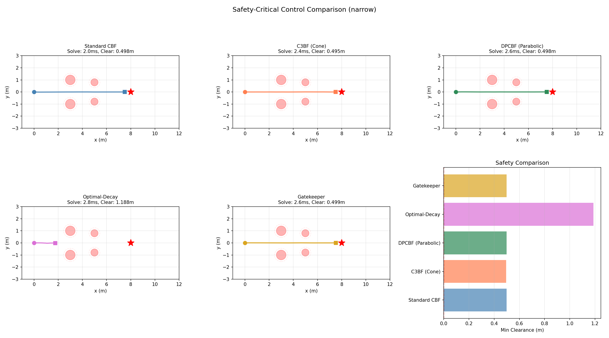

**좁은 통로 시나리오**: 양측 장애물 사이 좁은 통로 통과. DPCBF의 방향별 적응 경계가 측면 통과 시 불필요한 회피를 감소.

---

#### GPU 벤치마크 (CPU vs GPU)

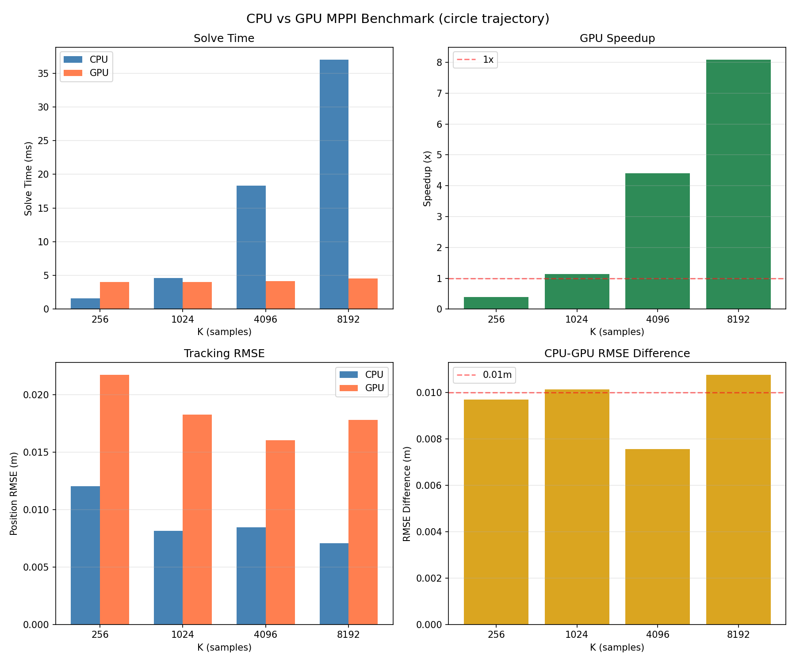

**PyTorch CUDA 가속**: K=4096에서 4.4x, K=8192에서 8.1x speedup. GPU 시간 ~4ms 일정.

| K | CPU (ms) | GPU (ms) | Speedup |
|---|----------|----------|---------|
| 256 | 1.6 | 4.0 | 0.4x |
| 1,024 | 4.6 | 4.0 | 1.1x |
| 4,096 | 18.4 | 4.2 | **4.4x** |
| 8,192 | 37.0 | 4.6 | **8.1x** |

---

### 학습 모델 비교

#### Neural Dynamics 학습 결과

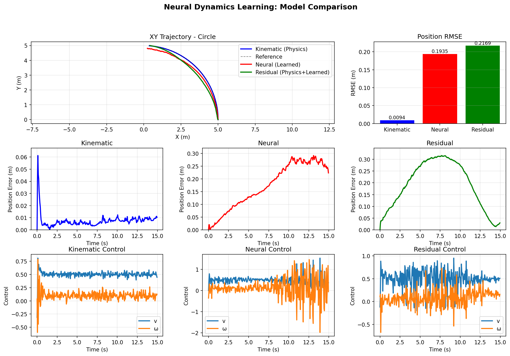

**9패널 종합 분석** (Physics vs Neural vs Residual):
- 상단: XY 궤적, X/Y 시계열
- 중단: Position/Heading 오차
- 하단: 제어 입력, 성능 요약

| 모델 | RMSE (m) | Heading RMSE (rad) | 계산 시간 (ms) |
|------|----------|-------------------|----------------|
| Physics (Kinematic) | 0.007 | 0.004 | 4.6 |
| Neural (Learned) | 0.068 | 0.038 | 24.0 |
| Residual (Hybrid) | 0.092 | 0.051 | 31.0 |

---

#### Neural Dynamics 학습 곡선

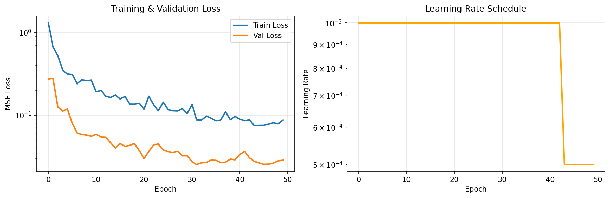

**학습 프로세스**:
- 데이터: 600 샘플 (30초 원형 궤적)
- 모델: MLP [128, 128, 64], 25,731 파라미터
- 학습: 63 에포크 (early stopping)
- 최종 Val Loss: 0.019

---

## 📚 문서

### 프로젝트 문서
- [PRD (Product Requirements Document)](docs/mppi/PRD.md)
- [Implementation Status](docs/mppi/IMPLEMENTATION_STATUS.md)
- [CLAUDE Development Guide](CLAUDE.md)
- [TODO List](TODO.md)

### Safety-Critical Control 가이드
- [Safety-Critical Control 종합 가이드](docs/safety/SAFETY_CRITICAL_CONTROL.md)

### 학습 모델 가이드
- [학습 모델 종합 가이드](docs/learned_models/LEARNED_MODELS_GUIDE.md)
- [온라인 학습 가이드](docs/learned_models/ONLINE_LEARNING.md)

## 🔬 참고 논문

### Vanilla MPPI
- Williams et al. (2016) - "Aggressive Driving with MPPI"
- Williams et al. (2017) - "Information Theoretic MPC"

### M2 고도화
- Williams et al. (2018) - "Robust Sampling Based MPPI" (Tube-MPPI)

### M3 SOTA 변형
- Yin et al. (2021) - "Tsallis Entropy for MPPI"
- Yin et al. (2023) - "Risk-Aware MPPI"
- Lambert et al. (2020) - "Stein Variational MPC"

### M3.5 확장 변형
- Kim et al. (2021) - "Smooth MPPI"
- Bhardwaj et al. (2024) - "Spline-MPPI"
- Kondo et al. (2024) - "SVG-MPPI"

### Safety-Critical Control
- Thirugnanam et al. (2024) - "Safety-Critical Control with Collision Cone CBFs"
- Zeng et al. (2021) - "Safety-Critical MPC with Discrete-Time CBF"
- Kim et al. (2026) - "Dynamic Parabolic CBFs" (ICRA 2026)
- Gurriet et al. (2020) - "Scalable Safety-Critical Control of Robotic Systems"
- Rimon & Koditschek (1992) - "Exact Robot Navigation Using Artificial Potential Functions"

## 🛠️ 개발 로드맵

### ✅ 완료 (M1-M3.5, M3.6, GPU, Safety)
- [x] 9가지 MPPI 변형 구현
- [x] 3가지 로봇 모델 타입 (Kinematic/Dynamic/Learned)
- [x] 5가지 Safety-Critical Control (CBF/C3BF/DPCBF/Optimal-Decay/Gatekeeper)
- [x] Shield-MPPI + Superellipsoid 장애물
- [x] 동적 장애물 감지/추적/회피
- [x] GPU 가속 (PyTorch CUDA, 8.1x speedup)
- [x] 종합 벤치마크 + Safety 비교 데모
- [x] 134개 유닛 테스트 (17 파일)

### 🚧 진행 중 (M4)
- [ ] ROS2 통합
- [ ] nav2 Controller 플러그인
- [ ] RVIZ 실시간 시각화

### 📅 계획 중 (M5)
- [ ] C++ 포팅 (실시간 성능)
- [ ] GPU 가속 MPPI 변형 확장 (현재 Vanilla만 지원)
- [ ] 추가 로봇 모델 (Swerve, Ackermann)
- [ ] Backup CBF (Sensitivity Propagation)
- [ ] Multi-robot CBF (다중 에이전트 충돌 회피)

## 🤝 기여

이슈 및 PR을 환영합니다!

1. Fork the repository
2. Create your feature branch (`git checkout -b feature/AmazingFeature`)
3. Commit your changes (`git commit -m 'Add some AmazingFeature'`)
4. Push to the branch (`git push origin feature/AmazingFeature`)
5. Open a Pull Request

## 📄 라이센스

이 프로젝트는 MIT 라이센스를 따릅니다. 자세한 내용은 [LICENSE](LICENSE) 파일을 참조하세요.

## 👨‍💻 개발자

**Geonhee Lee**
- GitHub: [@Geonhee-LEE](https://github.com/Geonhee-LEE)

**With assistance from:**
- Claude Sonnet 4.5 / Opus 4.6 (Anthropic)

## 🙏 감사의 말

이 프로젝트는 다음 오픈소스 프로젝트들을 참고하여 개발되었습니다:

- [pytorch_mppi](https://github.com/UM-ARM-Lab/pytorch_mppi) - PyTorch GPU MPPI
- [mppi_playground](https://github.com/kohonda/mppi_playground) - MPPI 벤치마크
- [toy_claude_project](https://github.com/Geonhee-LEE/toy_claude_project) - 9가지 MPPI 변형

## 📞 연락

질문이나 제안이 있으시면 이슈를 열어주세요!

---

**Made with ❤️ using Claude Code**
