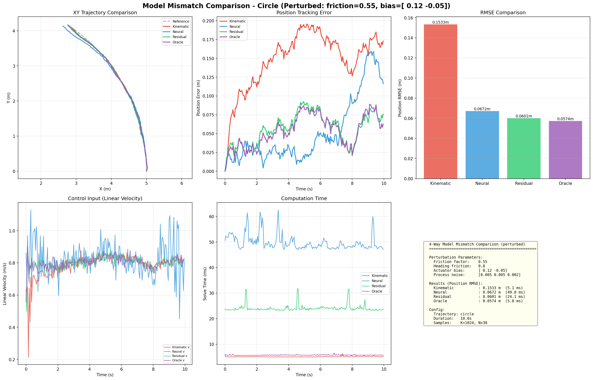
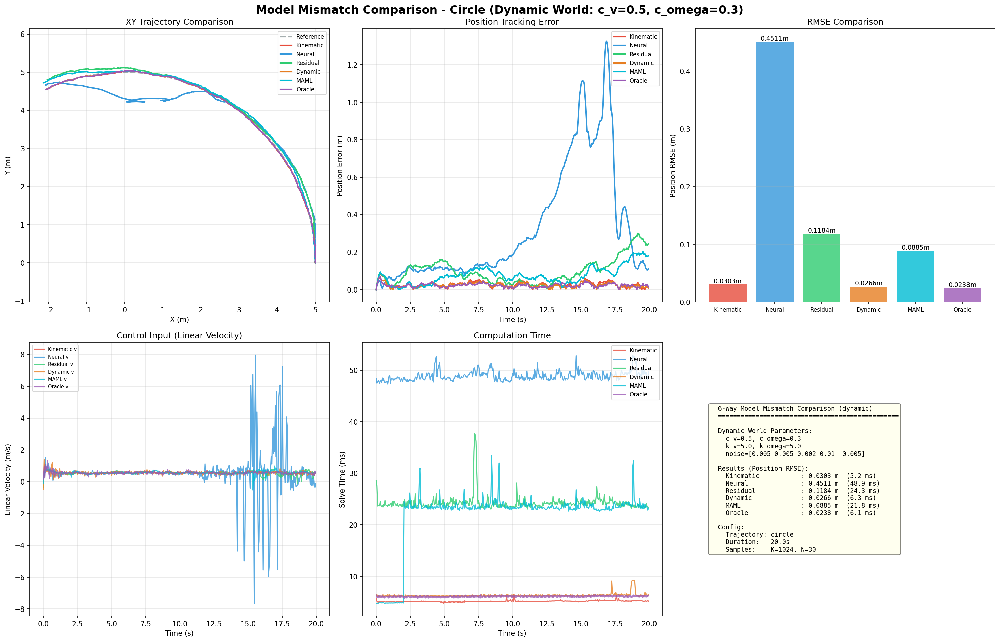

# MPPI ROS2 - Model Predictive Path Integral Control

[](https://www.python.org/)
[](LICENSE)
[](tests/)

A comprehensive MPPI (Model Predictive Path Integral) control library featuring 9 SOTA variants, 8 safety-critical control methods, 5 robot model types, GPU acceleration, and learning-based dynamics.

## Key Features

### 9 MPPI Variants

| # | Variant | Reference | Key Feature |
|---|---------|-----------|-------------|
| 1 | **Vanilla MPPI** | Williams et al., 2016 | Baseline implementation |
| 2 | **Tube-MPPI** | Williams et al., 2018 | Disturbance robustness |
| 3 | **Log-MPPI** | - | Numerical stability (log-space softmax) |
| 4 | **Tsallis-MPPI** | Yin et al., 2021 | Exploration/exploitation tuning |
| 5 | **Risk-Aware MPPI** | Yin et al., 2023 | CVaR-based conservative control |
| 6 | **Smooth MPPI** | Kim et al., 2021 | Input-lifting for control smoothness |
| 7 | **SVMPC** | Lambert et al., 2020 | Stein Variational sample diversity |
| 8 | **Spline-MPPI** | Bhardwaj et al., 2024 | Memory-efficient B-spline interpolation |
| 9 | **SVG-MPPI** | Kondo et al., 2024 | Guide particle SVGD |

### 5 Robot Model Types

- **Differential Drive** (Kinematic / Dynamic) - (v, w) velocity control
- **Ackermann** (Kinematic / Dynamic) - Bicycle model with steering angle
- **Swerve Drive** (Kinematic / Dynamic) - Omnidirectional movement
- **Neural Dynamics** - PyTorch MLP end-to-end learning
- **Gaussian Process** - Uncertainty-aware dynamics
- **Residual Dynamics** - Physics + learned correction

### 8 Safety-Critical Control Methods

| # | Method | Type | Key Feature |
|---|--------|------|-------------|
| 1 | **Standard CBF** | Cost + QP filter | Distance-based barrier |
| 2 | **C3BF (Collision Cone)** | Cost | Relative velocity-aware barrier |
| 3 | **DPCBF (Dynamic Parabolic)** | Cost | LoS coordinate + adaptive boundary |
| 4 | **Optimal-Decay CBF** | QP filter | Joint (u, w) optimization, guaranteed feasibility |
| 5 | **Gatekeeper** | Backup shield | Backup trajectory verification, infinite-time safety |
| 6 | **Backup CBF** | QP filter | Sensitivity propagation, multi-timestep constraints |
| 7 | **Multi-Robot CBF** | Cost + QP filter | Pairwise inter-robot collision avoidance |
| 8 | **Shield-MPPI** | Rollout shielding | Per-timestep analytical CBF enforcement |

Additional capabilities:
- **MPCC (Model Predictive Contouring Control)** - Contouring/lag error decomposition for superior path following
- **Superellipsoid obstacles** - Non-circular obstacle shapes (ellipses, rectangles)
- **Dynamic obstacle avoidance** - LaserScan-based detection/tracking + velocity estimation

### GPU Acceleration (PyTorch CUDA)

Enable GPU acceleration with just `device="cuda"`. No changes to existing CPU code required.

| K (samples) | CPU | GPU (RTX 5080) | Speedup |
|-------------|-----|----------------|---------|
| 256 | 1.6ms | 4.0ms | 0.4x |
| 1,024 | 4.6ms | 4.0ms | 1.1x |
| **4,096** | **18.4ms** | **4.2ms** | **4.4x** |
| **8,192** | **37.0ms** | **4.6ms** | **8.1x** |

> GPU time stays constant at ~4ms regardless of K. Shines at K=4096+ for large-scale sampling.

### Learning-Based Models

- **5 model types**: Neural Network, Gaussian Process, Residual, Ensemble NN, MC-Dropout Bayesian NN
- **Uncertainty-aware cost**: GP/Ensemble std-proportional penalty
- **Online learning**: Real-time model adaptation with checkpoint versioning and auto-rollback
- **Model validation**: RMSE/MAE/R2/rollout error comparison framework

---

## Performance Benchmarks

### Accuracy vs Speed

| Variant | RMSE | Solve Time | Key Strength |
|---------|------|------------|--------------|
| **SVG-MPPI** | **0.005m** | 51ms | Best accuracy |
| **Vanilla** | 0.006m | **5.0ms** | Fastest |
| **Spline** | 0.012m | 14ms | 73% less memory |
| **SVMPC** | 0.007m | 1035ms | Sample diversity |

### Safety Comparison (Static Obstacles)

| Method | Solve (ms) | Min Clearance (m) | Collision | Feature |
|--------|-----------|-------------------|-----------|---------|
| Standard CBF | 2.1 | 0.22 | No | Distance barrier |
| **C3BF** | 2.5 | 0.15 | No | Zero cost when receding |
| **DPCBF** | 2.6 | 0.21 | No | Directional adaptive boundary |
| Optimal-Decay | 2.7 | 1.12 | No | Most conservative |
| Gatekeeper | 2.7 | 0.24 | No | Infinite-time safety |

> All 5 methods achieve **zero collisions** across all scenarios.

### MPCC vs Tracking Cost (S-Curve)

| Method | Mean Path Error | Max Path Error |
|--------|----------------|----------------|
| **MPCC** | **0.004m** | 0.013m |
| Tracking | 0.553m | 1.415m |

> MPCC decomposes path following into contouring (perpendicular) and lag (tangential) errors, yielding **130x better** path accuracy.

---

## Quick Start

### Installation

```bash
git clone https://github.com/Geonhee-LEE/mppi_ros2.git
cd mppi_ros2
pip install -r requirements.txt
pip install -e .
```

### Basic Usage

```python
import numpy as np
from mppi_controller.models.kinematic.differential_drive_kinematic import DifferentialDriveKinematic
from mppi_controller.controllers.mppi.base_mppi import MPPIController
from mppi_controller.controllers.mppi.mppi_params import MPPIParams
from mppi_controller.simulation.simulator import Simulator
from mppi_controller.utils.trajectory import create_trajectory_function, generate_reference_trajectory

# 1. Create model
model = DifferentialDriveKinematic(v_max=1.0, omega_max=1.0)

# 2. Set MPPI parameters
params = MPPIParams(
    N=30,           # Prediction horizon
    dt=0.05,        # Time step
    K=1024,         # Number of samples
    lambda_=1.0,    # Temperature parameter
    sigma=np.array([0.5, 0.5]),  # Noise std
    Q=np.array([10.0, 10.0, 1.0]),  # State tracking weights
    R=np.array([0.1, 0.1]),  # Control effort weights
)

# 3. Create controller
controller = MPPIController(model, params)

# 4. Set up simulator
simulator = Simulator(model, controller, params.dt)

# 5. Reference trajectory
trajectory_fn = create_trajectory_function('circle')

def reference_fn(t):
    return generate_reference_trajectory(trajectory_fn, t, params.N, params.dt)

# 6. Run simulation
initial_state = trajectory_fn(0.0)
simulator.reset(initial_state)
history = simulator.run(reference_fn, duration=15.0)
```

### GPU Acceleration

```python
# Just set device="cuda" — no other code changes needed
params = MPPIParams(
    N=30, dt=0.05,
    K=4096,         # GPU handles large K at ~4ms!
    lambda_=1.0,
    sigma=np.array([0.5, 0.5]),
    Q=np.array([10.0, 10.0, 1.0]),
    R=np.array([0.1, 0.1]),
    device="cuda",  # Switch from "cpu" to "cuda"
)
controller = MPPIController(model, params)

# Returns numpy arrays — 100% compatible with existing code
control, info = controller.compute_control(state, reference_trajectory)
```

### Using Different MPPI Variants

```python
# SVG-MPPI (best accuracy)
from mppi_controller.controllers.mppi.svg_mppi import SVGMPPIController
from mppi_controller.controllers.mppi.mppi_params import SVGMPPIParams

params = SVGMPPIParams(
    N=30, dt=0.05, K=1024,
    svg_num_guide_particles=32,
    svgd_num_iterations=3,
)
controller = SVGMPPIController(model, params)

# Tube-MPPI (disturbance robustness)
from mppi_controller.controllers.mppi.tube_mppi import TubeMPPIController
from mppi_controller.controllers.mppi.mppi_params import TubeMPPIParams

params = TubeMPPIParams(
    N=30, dt=0.05, K=1024,
    tube_enabled=True,
    K_fb=np.array([[2.0, 0.0, 0.0], [0.0, 2.0, 0.0]]),
)
controller = TubeMPPIController(model, params)

# Spline-MPPI (memory efficient)
from mppi_controller.controllers.mppi.spline_mppi import SplineMPPIController
from mppi_controller.controllers.mppi.mppi_params import SplineMPPIParams

params = SplineMPPIParams(
    N=30, dt=0.05, K=1024,
    spline_num_knots=8,
    spline_degree=3,
)
controller = SplineMPPIController(model, params)
```

### Safety-Critical Control

```python
# CBF-MPPI with QP safety filter
from mppi_controller.controllers.mppi.cbf_mppi import CBFMPPIController
from mppi_controller.controllers.mppi.mppi_params import CBFMPPIParams

params = CBFMPPIParams(
    N=30, dt=0.05, K=1024,
    cbf_alpha=0.3,
    cbf_obstacles=[(3.0, 0.5, 0.4), (5.0, -0.3, 0.3)],
)
controller = CBFMPPIController(model, params)

# MPCC for superior path following
from mppi_controller.controllers.mppi.mpcc_cost import MPCCCost

waypoints = np.array([[0, 0], [5, 0], [5, 5], [0, 5]])
mpcc_cost = MPCCCost(reference_path=waypoints, Q_c=50.0, Q_l=10.0, Q_theta=5.0)
controller = MPPIController(model, params, mpcc_cost)
```

### Learning-Based Models

```python
# Neural Network dynamics
from mppi_controller.models.learned.neural_dynamics import NeuralDynamics

neural_model = NeuralDynamics(
    state_dim=3, control_dim=2,
    model_path="models/learned_models/my_model.pth"
)
controller = MPPIController(neural_model, params)

# Residual Learning (physics + learned correction)
from mppi_controller.models.learned.residual_dynamics import ResidualDynamics

residual_model = ResidualDynamics(
    base_model=kinematic_model,
    residual_fn=lambda s, u: neural_model.forward_dynamics(s, u) - kinematic_model.forward_dynamics(s, u)
)

# Online learning (real-time model adaptation)
from mppi_controller.learning.online_learner import OnlineLearner

online_learner = OnlineLearner(
    model=neural_model, trainer=trainer,
    buffer_size=1000, min_samples_for_update=100,
    update_interval=500,
)

for t in range(num_steps):
    control = controller.compute_control(state, ref)
    next_state = apply_control(control)
    online_learner.add_sample(state, control, next_state, dt)
```

---

## Examples

### Basic Demos

```bash
# Vanilla MPPI (circle trajectory)
python examples/kinematic/mppi_differential_drive_kinematic_demo.py --trajectory circle

# Figure-8 / sine trajectories
python examples/kinematic/mppi_differential_drive_kinematic_demo.py --trajectory figure8
python examples/kinematic/mppi_differential_drive_kinematic_demo.py --trajectory sine
```

### Model Comparison

```bash
# Kinematic vs Dynamic
python examples/comparison/kinematic_vs_dynamic_demo.py --trajectory circle

# Ackermann model demo
python examples/comparison/mppi_ackermann_demo.py

# Swerve drive demo
python examples/comparison/mppi_swerve_drive_demo.py
```

### Model Mismatch Comparison

Demonstrates the value of learned models when model mismatch exists between the controller's internal model and reality.

```bash
# Perturbed world (4-way: Kinematic / Neural / Residual / Oracle)
python examples/comparison/model_mismatch_comparison_demo.py --all --trajectory circle --duration 20

# Dynamic world (5-way: + Dynamic 5D adapter)
# Uses DifferentialDriveDynamic (5D, inertia+friction) as "real world"
python examples/comparison/model_mismatch_comparison_demo.py --all --world dynamic --trajectory circle --duration 20

# Live animation
python examples/comparison/model_mismatch_comparison_demo.py --live --world dynamic --trajectory circle
```

| # | Controller | State | Description |
|---|-----------|-------|-------------|
| 1 | Kinematic | 3D | No knowledge of friction/inertia |
| 2 | Neural | 3D | End-to-end learned from data |
| 3 | Residual | 3D | Physics + NN correction (hybrid) |
| 4 | Dynamic | 5D | Correct structure, wrong parameters (c_v=0.1 vs 0.5) |
| 5 | Oracle | 5D | Exact parameters (theoretical upper bound) |

### MPPI Variant Benchmarks

```bash
# Full 9-variant comparison
python examples/mppi_all_variants_benchmark.py --trajectory circle --duration 15

# Individual variant comparisons
python examples/comparison/smooth_mppi_models_comparison.py --trajectory circle
python examples/comparison/spline_mppi_models_comparison.py --trajectory circle
python examples/comparison/svg_mppi_models_comparison.py --trajectory circle
python examples/comparison/svmpc_models_comparison.py --trajectory circle
```

### Safety-Critical Control

```bash
# 5-way safety comparison (static / crossing / narrow)
python examples/comparison/safety_comparison_demo.py --scenario static
python examples/comparison/safety_comparison_demo.py --scenario crossing
python examples/comparison/safety_comparison_demo.py --scenario narrow

# S3 advanced safety (Backup CBF / Multi-robot / MPCC)
python examples/comparison/safety_s3_comparison_demo.py --scenario backup_cbf
python examples/comparison/safety_s3_comparison_demo.py --scenario multi_robot
python examples/comparison/safety_s3_comparison_demo.py --scenario mpcc

# Live animation mode
python examples/comparison/safety_comparison_demo.py --live
```

### GPU Benchmark

```bash
python examples/comparison/gpu_benchmark_demo.py --trajectory circle --duration 10
```

### Learning Models

```bash
# Neural network training pipeline
python examples/learned/neural_dynamics_learning_demo.py --all

# GP vs Neural comparison
python examples/learned/gp_vs_neural_comparison_demo.py --all

# Online learning demo
python examples/learned/online_learning_demo.py --duration 60.0 --plot
```

### Simulation Environments (10 Scenarios)

10 diverse simulation environments showcasing all MPPI variants, safety controllers, and robot models.
See the full guide at [docs/SIMULATION_ENVIRONMENTS.md](docs/SIMULATION_ENVIRONMENTS.md).

```bash
# Run ALL 10 scenarios (batch, ~218s)
PYTHONPATH=. python examples/simulation_environments/run_all.py

# Run specific scenarios
PYTHONPATH=. python examples/simulation_environments/run_all.py --scenarios s1 s2 s6

# Individual scenarios (with live animation)
PYTHONPATH=. python examples/simulation_environments/scenarios/static_obstacle_field.py --live
PYTHONPATH=. python examples/simulation_environments/scenarios/dynamic_bouncing.py --live
PYTHONPATH=. python examples/simulation_environments/scenarios/chasing_evading.py --live
PYTHONPATH=. python examples/simulation_environments/scenarios/multi_robot_coordination.py
PYTHONPATH=. python examples/simulation_environments/scenarios/waypoint_navigation.py
PYTHONPATH=. python examples/simulation_environments/scenarios/drifting_disturbance.py --noise 0.5
PYTHONPATH=. python examples/simulation_environments/scenarios/parking_precision.py
PYTHONPATH=. python examples/simulation_environments/scenarios/racing_mpcc.py
PYTHONPATH=. python examples/simulation_environments/scenarios/narrow_corridor.py --live
PYTHONPATH=. python examples/simulation_environments/scenarios/mixed_challenge.py

# Batch mode (no plot window, for CI/testing)
PYTHONPATH=. python examples/simulation_environments/scenarios/dynamic_bouncing.py --no-plot
```

| # | Scenario | Controllers | Key Feature |
|---|----------|-------------|-------------|
| S1 | Static Obstacle Field | Vanilla / CBF / Shield | Random/slalom/dense obstacle layouts |
| S2 | Dynamic Bouncing | CBF / C3BF / Shield | Velocity-aware barrier (5-tuple obstacles) |
| S3 | Chasing Evader | Shield / DPCBF / CBF | Predator pursuit with directional CBF |
| S4 | Multi-Robot Coordination | 4-way CBF | 4 robots swap positions (pairwise CBF) |
| S5 | Waypoint Navigation | Vanilla / CBF | WaypointStateMachine with dwell times |
| S6 | Drifting Disturbance | Vanilla / Tube / Risk-Aware | Process noise robustness comparison |
| S7 | Parking Precision | 3 MPPI configs | Ackermann + SuperellipsoidCost |
| S8 | Racing MPCC | MPCC / Tracking | Contouring/lag error decomposition |
| S9 | Narrow Corridor | CBF / Shield / Aggressive | Tight L-shaped passages + funnel |
| S10 | Mixed Challenge | Shield-MPPI | Static + dynamic + corridor combined |

---

## Results Gallery

### MPPI Variant Comparison

#### All Variants Benchmark (9 Variants)


**9-panel analysis**: XY trajectory, position/heading error, control inputs, and computation time for all 9 MPPI variants.

| Variant | RMSE (m) | Solve Time (ms) | Feature |
|---------|----------|-----------------|---------|
| Vanilla | 0.006 | 5.0 | Baseline |
| Tube | 0.023 | 5.5 | Disturbance robustness |
| Log | 0.006 | 5.1 | Numerical stability |
| Tsallis | 0.006 | 5.2 | Exploration tuning |
| Risk-Aware | 0.008 | 5.3 | CVaR conservative |
| SVMPC | 0.007 | 1035 | O(K^2) diversity |
| Smooth | 0.006 | 5.4 | Control smoothness |
| Spline | 0.012 | 14.5 | 73% less memory |
| **SVG** | **0.005** | 51.3 | **Best accuracy** |

---

#### Vanilla vs Tube MPPI


**Disturbance robustness**: Tube-MPPI uses an ancillary controller to compensate for body-frame disturbances.

---

#### Vanilla vs Log MPPI


**Numerical stability**: Log-space softmax prevents NaN/Inf in weight computation.

---

#### Smooth MPPI (per model)


**Input-lifting comparison**: Kinematic vs Dynamic vs Residual models with delta-u minimization.

---

#### Spline MPPI (per model)


**B-spline interpolation**: 16,384 -> 4,096 elements (73% memory reduction).

---

#### SVG-MPPI (per model)


**Guide particle SVGD**: O(K^2) -> O(G^2) complexity reduction with 0.005m best accuracy.

---

#### SVMPC (per model)


**Stein Variational MPC**: O(K^2) kernel operations for sample diversity (1035ms).

---

### Safety-Critical Control

#### CBF-MPPI Obstacle Avoidance


**Control Barrier Function**: CBF cost penalty maintains safe distance. Cost increases exponentially near obstacles.

---

#### Shield-MPPI


**Shielded Rollout**: Per-timestep analytical CBF enforcement. All K sample trajectories guaranteed safe.

---

#### Dynamic Obstacle Avoidance


**LaserScan-based real-time avoidance**: Obstacle detection/tracking + CBF/Shield 3-way comparison.

---

#### Safety Comparison (Static Obstacles)


**5 safety methods comparison**: Standard CBF, C3BF (Collision Cone), DPCBF (Dynamic Parabolic), Optimal-Decay CBF, Gatekeeper. Zero collisions across all methods.

---

#### Safety Comparison (Crossing Obstacles)


**Dynamic obstacle crossing scenario**: Obstacles cross from top/bottom. C3BF considers relative velocity for more efficient avoidance paths.

---

#### Safety Comparison (Narrow Passage)


**Narrow passage scenario**: Passing through closely-spaced obstacles. DPCBF's directional adaptive boundary reduces unnecessary avoidance.

---

### GPU Benchmark


**PyTorch CUDA acceleration**: 4.4x speedup at K=4096, 8.1x at K=8192. GPU time constant at ~4ms.

---

### Learning Models

#### Neural Dynamics Training & Comparison


**9-panel analysis** (Physics vs Neural vs Residual): XY trajectory, time-series, position/heading error, control inputs, performance summary.


**Training process**: 600 samples (30s circle trajectory), MLP [128, 128, 64] with 25,731 parameters, 63 epochs (early stopping), final val loss: 0.019.

---

#### Model Mismatch Comparison (Perturbed World)



**4-way comparison** (perturbed kinematic world): Oracle(0.057m) < Residual(0.060m) < Neural(0.067m) << Kinematic(0.153m). Residual (physics+NN) nearly matches oracle.

---

#### Model Mismatch Comparison (Dynamic World)



**5-way comparison** (5D dynamic world with inertia+friction): Oracle(0.024m) < Dynamic(0.026m) < Kinematic(0.031m). Structural knowledge (5D adapter) outperforms pure learning.

---

## Project Structure

```
mppi_ros2/
├── mppi_controller/
│   ├── models/                     # Robot dynamics models
│   │   ├── base_model.py           # Abstract base class
│   │   ├── kinematic/              # Kinematic models (DiffDrive, Ackermann, Swerve)
│   │   ├── dynamic/                # Dynamic models (friction, inertia)
│   │   └── learned/                # Learning models (NN, GP, Residual, Ensemble, MC-Dropout)
│   │
│   ├── controllers/mppi/           # MPPI controllers
│   │   ├── base_mppi.py            # Vanilla MPPI (+ GPU path)
│   │   ├── tube_mppi.py            # Tube-MPPI
│   │   ├── log_mppi.py             # Log-MPPI
│   │   ├── tsallis_mppi.py         # Tsallis-MPPI
│   │   ├── risk_aware_mppi.py      # Risk-Aware MPPI
│   │   ├── smooth_mppi.py          # Smooth MPPI
│   │   ├── stein_variational_mppi.py  # SVMPC
│   │   ├── spline_mppi.py          # Spline-MPPI
│   │   ├── svg_mppi.py             # SVG-MPPI
│   │   ├── cbf_mppi.py             # CBF-MPPI
│   │   ├── shield_mppi.py          # Shield-MPPI
│   │   ├── c3bf_cost.py            # Collision Cone CBF
│   │   ├── dpcbf_cost.py           # Dynamic Parabolic CBF
│   │   ├── optimal_decay_cbf_filter.py  # Optimal-Decay CBF
│   │   ├── backup_cbf_filter.py    # Backup CBF (sensitivity propagation)
│   │   ├── multi_robot_cbf.py      # Multi-Robot CBF
│   │   ├── gatekeeper.py           # Gatekeeper Safety Shield
│   │   ├── backup_controller.py    # Backup Controllers
│   │   ├── superellipsoid_cost.py  # Superellipsoid obstacles
│   │   ├── mpcc_cost.py            # MPCC (contouring control)
│   │   ├── mppi_params.py          # Parameter classes
│   │   ├── dynamics_wrapper.py     # Batch dynamics
│   │   ├── cost_functions.py       # Cost functions
│   │   ├── sampling.py             # Noise samplers
│   │   └── gpu/                    # GPU acceleration (PyTorch CUDA)
│   │
│   ├── learning/                   # Learning pipeline
│   │   ├── data_collector.py       # Data collection
│   │   ├── neural_network_trainer.py  # NN trainer
│   │   ├── gaussian_process_trainer.py  # GP trainer
│   │   ├── ensemble_trainer.py     # Ensemble trainer
│   │   ├── online_learner.py       # Online learning
│   │   └── model_validator.py      # Model validation
│   │
│   ├── perception/                 # Obstacle perception
│   │   ├── obstacle_detector.py    # LaserScan → obstacles
│   │   └── obstacle_tracker.py     # Nearest-neighbor tracking
│   │
│   ├── simulation/                 # Simulation tools
│   └── utils/                      # Utilities
│
├── tests/                          # Unit tests (381 tests, 33 files)
├── examples/                       # Demo scripts
│   └── simulation_environments/    # 10 simulation scenarios
│       ├── common/                 # Shared infrastructure (ABC, obstacles, visualizer)
│       ├── scenarios/              # S1~S10 scenario scripts
│       └── run_all.py              # Batch runner + summary
├── plots/                          # Result plots
├── docs/                           # Documentation
└── configs/                        # Configuration files
```

## Testing

```bash
# Run all tests
PYTHONPATH=. python -m pytest tests/ -v -o "addopts="

# Run specific test files
PYTHONPATH=. python -m pytest tests/test_safety_s3.py -v -o "addopts="
PYTHONPATH=. python -m pytest tests/test_robot_models.py -v -o "addopts="
```

**Test status**: 381 tests passing across 33 test files

## ROS2 Integration

### Build & Run

```bash
# Create ROS2 workspace
mkdir -p ~/ros2_ws/src
cd ~/ros2_ws/src
ln -s ~/mppi_ros2 .

# Build
cd ~/ros2_ws
colcon build --packages-select mppi_ros2

source install/setup.bash
```

### Simulation

```bash
# Full system launch (with RVIZ)
ros2 launch mppi_ros2 mppi_sim.launch.py

# Select controller type
ros2 launch mppi_ros2 mppi_sim.launch.py controller_type:=svg

# Select trajectory type
ros2 launch mppi_ros2 mppi_sim.launch.py trajectory_type:=figure8

# Use dynamic model
ros2 launch mppi_ros2 mppi_sim.launch.py model_type:=dynamic
```

### Controller Selection Guide

| Controller | Best For |
|-----------|----------|
| `vanilla` | General tracking, real-time |
| `tube` | Disturbance-prone environments |
| `log` | Numerical stability |
| `svg` | High-precision tracking |
| `spline` | Memory-constrained systems |
| `risk_aware` | Safety-critical applications |
| `smooth` | Smooth control outputs |

### Trajectory Types

| Type | Description |
|------|-------------|
| `circle` | Circular trajectory |
| `figure8` | Figure-8 trajectory |
| `sine` | Sinusoidal trajectory |
| `lemniscate` | Infinity-shape trajectory |
| `straight` | Straight line |

---

## Use Case Recommendations

| Scenario | Recommended Variant | Reason |
|----------|-------------------|--------|
| Real-time control | Vanilla, Tube, Log | ~5ms ultra-fast |
| Large-scale sampling | Vanilla + GPU | K=8192 at ~4ms |
| Disturbance-prone | Tube-MPPI | Nominal + feedback robustness |
| High-precision tracking | SVG-MPPI | 0.005m best accuracy |
| Path following (curves) | MPCC | 130x better than tracking cost |
| Static obstacle avoidance | CBF/Shield-MPPI | CBF safety guarantee |
| Dynamic obstacles | C3BF / DPCBF | Velocity-aware avoidance |
| Dense environments | Optimal-Decay | Constraint relaxation for feasibility |
| Infinite-time safety | Gatekeeper / Backup CBF | Backup trajectory-based verification |
| Non-circular obstacles | Superellipsoid | Ellipse/rectangle obstacles |
| Multi-robot coordination | Multi-Robot CBF | Pairwise collision avoidance |
| Memory-constrained | Spline-MPPI | 73% memory reduction |
| Sim-to-real adaptation | Online Learning | Real-time model adaptation |

---

## Documentation

- [PRD (Product Requirements Document)](docs/mppi/PRD.md)
- [Implementation Status](docs/mppi/IMPLEMENTATION_STATUS.md)
- [Safety-Critical Control Guide](docs/safety/SAFETY_CRITICAL_CONTROL.md)
- [Learned Models Guide](docs/learned_models/LEARNED_MODELS_GUIDE.md)
- [Online Learning Guide](docs/learned_models/ONLINE_LEARNING.md)
- [Simulation Environments Guide](docs/SIMULATION_ENVIRONMENTS.md)
- [CLAUDE Development Guide](CLAUDE.md)

## References

### Core MPPI
- Williams et al. (2016) - "Aggressive Driving with MPPI"
- Williams et al. (2017) - "Information Theoretic MPC"
- Williams et al. (2018) - "Robust Sampling Based MPPI" (Tube-MPPI)

### SOTA Variants
- Yin et al. (2021) - "Tsallis Entropy for MPPI"
- Yin et al. (2023) - "Risk-Aware MPPI"
- Lambert et al. (2020) - "Stein Variational MPC"
- Kim et al. (2021) - "Smooth MPPI"
- Bhardwaj et al. (2024) - "Spline-MPPI"
- Kondo et al. (2024) - "SVG-MPPI"

### Safety-Critical Control
- Thirugnanam et al. (2024) - "Safety-Critical Control with Collision Cone CBFs"
- Zeng et al. (2021) - "Safety-Critical MPC with Discrete-Time CBF"
- Gurriet et al. (2020) - "Scalable Safety-Critical Control"
- Chen et al. (2021) - "Backup Control Barrier Functions"
- Liniger et al. (2015) - "Optimization-based Autonomous Racing" (MPCC)

## Roadmap

### Completed
- [x] 9 MPPI variants
- [x] 5 robot model types (Kinematic/Dynamic/Learned x DiffDrive/Ackermann/Swerve)
- [x] 8 safety-critical control methods + MPCC
- [x] GPU acceleration (PyTorch CUDA, 8.1x speedup)
- [x] Learning pipeline (NN/GP/Residual/Ensemble/MC-Dropout)
- [x] Online learning with checkpoint versioning
- [x] 319 unit tests (26 files)
- [x] 10 simulation environments (static/dynamic/multi-robot/parking/racing/corridor)

### In Progress
- [ ] ROS2 nav2 Controller plugin
- [ ] RVIZ real-time visualization

### Planned
- [ ] C++ porting (real-time performance)
- [ ] GPU acceleration for all MPPI variants

## Contributing

Issues and PRs are welcome!

1. Fork the repository
2. Create your feature branch (`git checkout -b feature/AmazingFeature`)
3. Commit your changes (`git commit -m 'Add some AmazingFeature'`)
4. Push to the branch (`git push origin feature/AmazingFeature`)
5. Open a Pull Request

## License

This project is licensed under the MIT License. See [LICENSE](LICENSE) for details.

## Author

**Geonhee Lee** - [@Geonhee-LEE](https://github.com/Geonhee-LEE)

**With assistance from:** Claude Sonnet 4.5 / Opus 4.6 (Anthropic)

## Acknowledgments

- [pytorch_mppi](https://github.com/UM-ARM-Lab/pytorch_mppi) - PyTorch GPU MPPI
- [mppi_playground](https://github.com/kohonda/mppi_playground) - MPPI benchmarks
- [toy_claude_project](https://github.com/Geonhee-LEE/toy_claude_project) - 9 MPPI variants

---

**Made with Claude Code**
